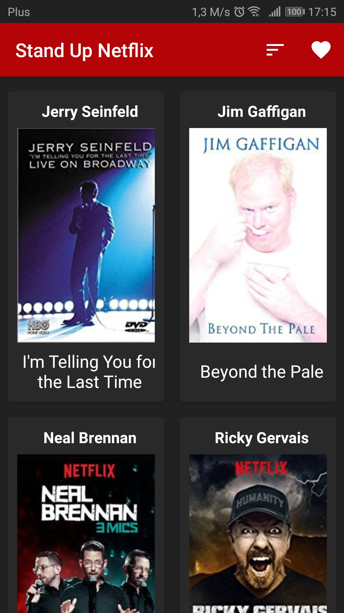
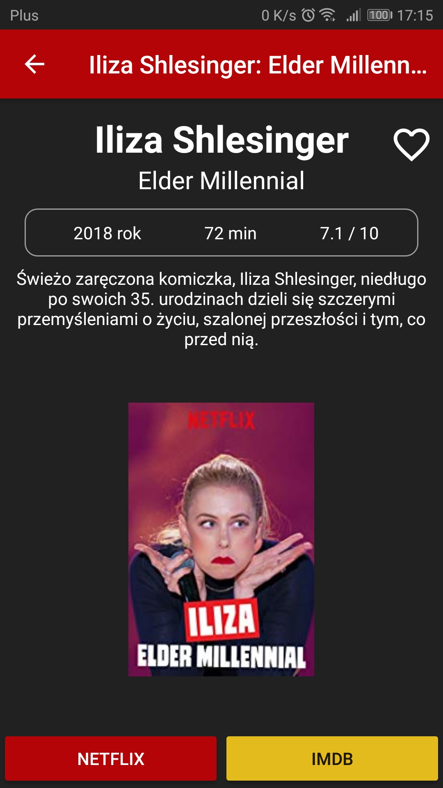
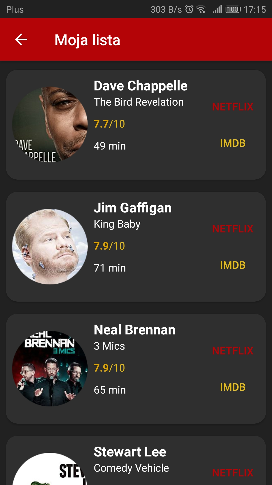
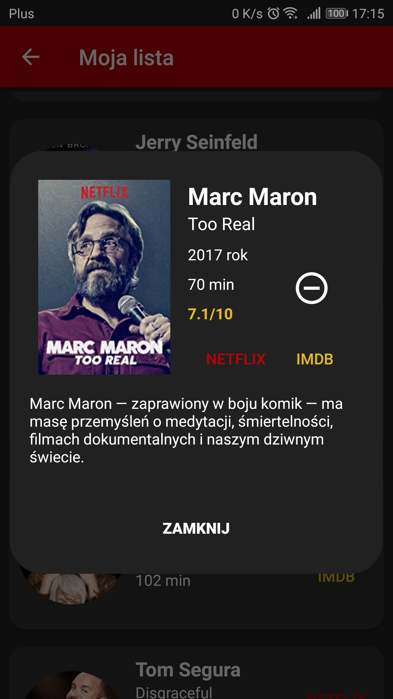

# StandUpNetflix

App made with Kotlin. It shows a list with all Stand Ups from Netflix and allows you to sort result (by year or rate) and add every position to your personal list.

## Libraries
* [Picasso](http://square.github.io/picasso/)
* [OKHttp](http://square.github.io/okhttp/)
* [Gson](https://github.com/google/gson)

## Screenshots
   
